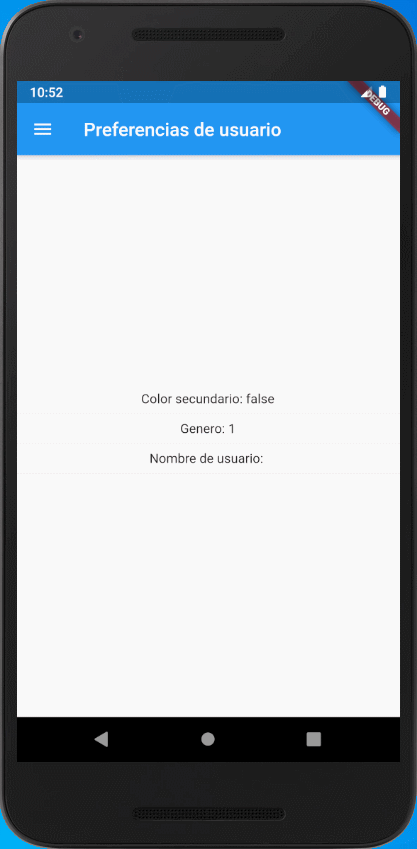

# Proyecto

<table border="0">
    <tr>
        <td></td>
        <td>Proyecto que permite guardar en preferencias datos del usuario que persiste aunque la aplicación se cierre.</td>
    </tr>
</table>

## Observaciones

Las librerías usadas son:

* Shared Preferences: Permite realizar persistencia de datos a lo largo del tiempo. (Hay que realizar las configuraciones en carpetas de Android/iOS). [Librería](https://pub.dev/packages/shared_preferences).

## Resultados

<table border="0">
    <tr>
        <td></td>
    </tr>
</table>